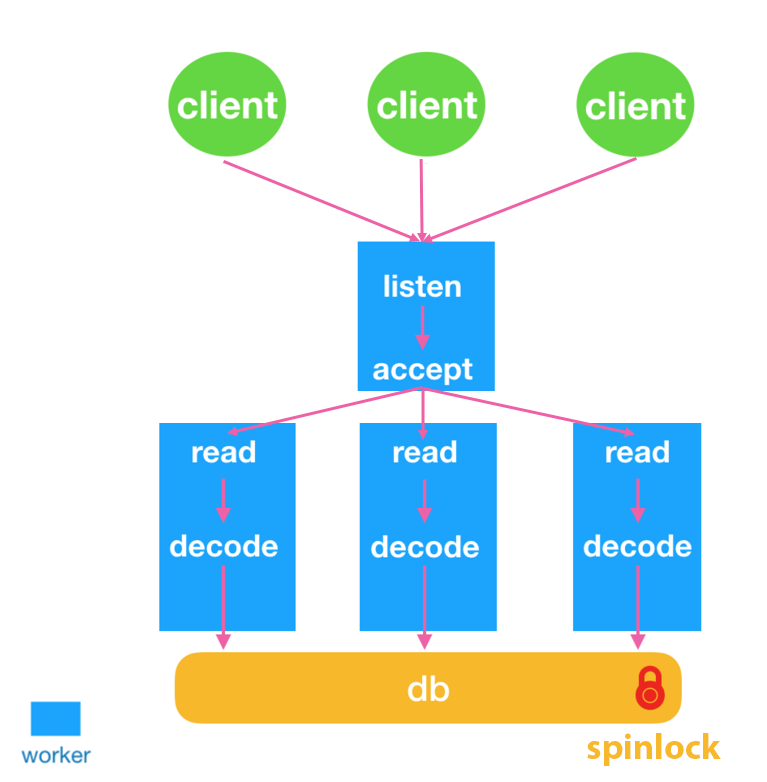

# Design

## Multithreading Architecture

Keva is multithreaded, running the [Netty](https://github.com/netty/netty) event loop on multiple threads (default is `num_cpu_core` * 2).
Each event loop thread is an I/O thread, responsible for reading data and parsing protocols, thus network I/O and query parsing are done concurrently.

The core hash table is [ChronicleMap](https://github.com/OpenHFT/Chronicle-Map), access to it from I/O threads guarded by a spin lock. [ChronicleMap](https://github.com/OpenHFT/Chronicle-Map)
is extremely fast and thus this lock has low contention. Transactions hold the lock for the duration of the `EXEC` command.

## Locking Mechanism

In order to ensure the `atomic` and `isolation` in Keva transactions, also the replication log (replicas) and write-a-head log (persistence), a global lock controls multithreading access to the hash table in memory is needed.

Keva implements `spin lock` mechanism:

> Spin lock: when a thread acquires a lock, if the lock is held by another thread, the current thread will wait in a loop until the lock is acquired.

Why? Like we mentioned above, this hash table is very fast and its lock has low contention, spin lock will not make the thread state switch,
always in the user state, that is, the thread is always active; it will not make the thread into the blocking state, reduce unnecessary context switching, and the execution speed is fast